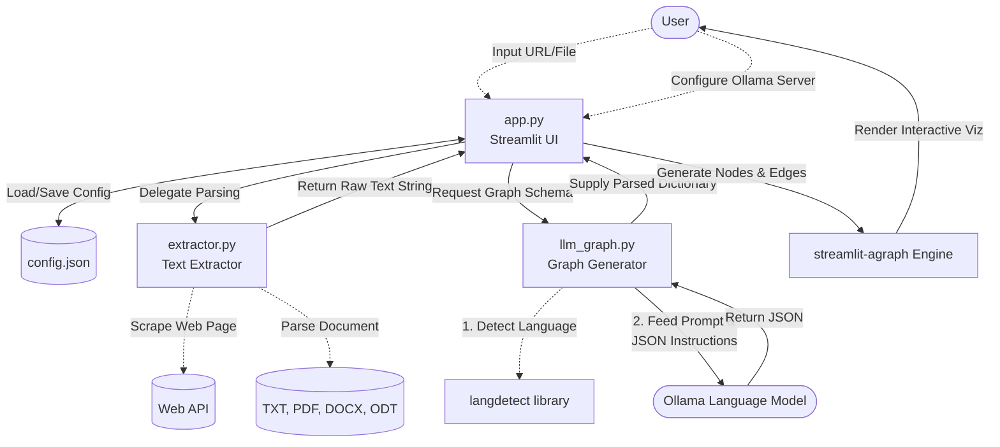

# Text to Graph Organizer Architecture

## Overview
The "Text to Graph Organizer" is a Python-based web application built with Streamlit. It allows users to extract the main themes, concepts, and relational structures from uploaded documents or web pages. By leveraging large language models (via Ollama), the application produces a visual, interactive knowledge graph designed to highlight the hierarchy and relationships embedded in the underlying text.

## Component Flow
1. **User Input:** The user provides text either as a file upload (TXT, PDF, DOCX, ODT) or a URL through the Streamlit interface. They also configure the Ollama server connection in the sidebar.
2. **Text Extraction:** The `extractor.py` module determines the source type (web URL vs. file extension) and extracts the raw textual content, stripping away irrelevant formatting or HTML tags.
3. **Graph Generation (LLM Base):** The `llm_graph.py` module manages communications with the Ollama inference server. It feeds the extracted text into the selected model with strict system prompts enforcing a JSON schema for nodes and edges.
4. **Interactive Visualization:** The `app.py` module receives the structured JSON representation and renders an interactive, physics-based network graph using the `streamlit-agraph` library. Source themes are distinguished from sub-themes visually with distinct colors and sizing.

## Architecture Diagram

## Core Elements

- **`app.py`**
  The main runtime component. Responsible for rendering the layout, coordinating state (like caching the server configuration), managing user uploads, and connecting the backend parsing logic to the frontend visualization. It dynamically builds the network elements and configures `streamlit-agraph` graph physics.

- **`extractor.py`**
  The data-ingestion utility. Designed to convert complex or proprietary file structures into a single cohesive string of text. Employs parsing libraries such as `BeautifulSoup` (for stripping noisy HTML elements from URLs), `pypdf`, `python-docx`, and `xml.etree.ElementTree` to handle multiple text formats.

- **`llm_graph.py`**
  The AI interface module. Contains instructions to communicate intelligently with Ollama. Notably, it runs language detection on the ingested text to instruct the LLM to output labels in the matching language. It enforces Pydantic-style (`Nodes` and `Edges`) JSON boundaries and handles network timeouts.

- **`config.json`**
  A localized, persistent configuration file storing user preferences like the preferred connection URL (`http://localhost:11434`) and the currently selected inferencing model to preserve settings between sessions.
